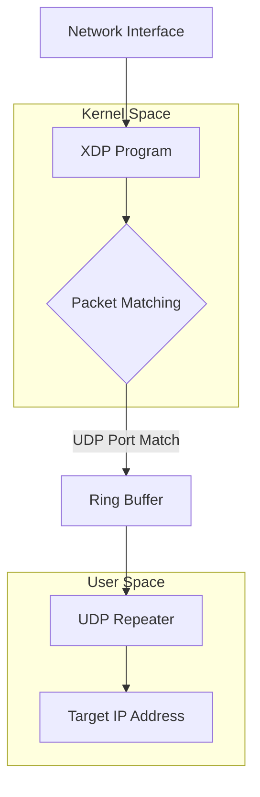

# UDP Packet Forwarder

This is a super efficient UDP packet capture and forwarding system built with an eBPF XDP program. It's designed for scenarios where you need to intercept UDP traffic at the kernel level and forward it to another destination.

I built it to replace socat as a method of moving packets from an external interface to a [service](https://github.com/bmtwl/SoftDataDiode) only allowed to listen on the loopback interface. As an extra bonus I was able to drop the original packet and mangle the retransmitted one to completely break the stateful connection (this may not always be desirable, but it was a design goal for me)

Since I was running on a VPS, I wanted to keep CPU usage as low as possible to avoid any extra charges.

The whole thing is pretty successful. The VPS with _nothing_ running sits at about 0.2% CPU usage. With socat acting as the packet forwarder it averages about 3.5%. When switching to this eBPF forwarder it averages 0.4%.

Since the cost-free sustainable cpu usage of this VPS is only 5%, this gives me a lot of extra headroom to run tons of streams and other services on this box before I cross over into having to incur costs.

## Design Goals

- **Low overhead**: Minimal CPU impact with packet processing happening in kernel space
- **Speed**: Use XDP in-kernel to capture packets at the earliest possible time to minimize processing on the packet that we don't need
- **Break Flows** Throw the originals away before they get any farther down the network stack and retransmit with totally different ip/port combinations
- **Flexibility**: Capture single ports (with optional port-translation) or port ranges

## How it works

An eBPF program is compiled against your kernal and attaches to a chosen network interface via XDP and intercepts UDP packets on specified ports. Then the captured packets are written to a mapped ring buffer for userspace access. A userspace daemon then reads from the ring buffer and forwards packets to your target destination:



## Use

### Clone, build the useland stuff and make the scripts executable

```bash
cd /opt
git clone https://github.com/bmtwl/udp-ebpf-monitor
cd udp-ebpf-monitor
make
chmod +x *.sh
```

### Capture packets

```bash
# Capture UDP packets on ports 5005-5010
./start_capture.sh 5005 5010 eth0

# Just one port
./start_capture.sh 53 53 eth0
```

### Forward them somewhere else

```bash
# Forward all captured packets to another server
./udp_repeater 5005-5010 192.168.1.100

# Single port version
./udp_repeater 5005 192.168.1.100

# Single port syntax can also forward to a different port
./udp_repeater 5353 192.168.1.100 53

```

### Clean up to remove maps and 
```bash
./stop_capture.sh 5005 5010 eth0
```

>[!TIP]
>There's also a tester program in the repo that just pukes out all the packets that hit the ring buffer as a quick sanity check

## Requirements

- Only tested with Debian Trixie. Needs a pretty new kernel (Bookworm didn't work)
- clang and llvm for eBPF compilation. Might need kernel headers, too
- bpftool for loading programs (v7.1.0 didn't work, but 7.5.0 did...probably need something closer to the latter)
- libbpf development libraries (again, v1.1 didn't work but 1.5 did)
- Probably other stuff I forgot...

## Troubleshooting

**"Failed to attach to interface" or "It broke some other XDP program!"**: Make sure no other XDP programs are running on that interface. Even if you do get a new one to load, bpftool will blow away the old XDP program.

**"Permission denied"**: You probably need to run as root for XDP start/stop operations. You should be able to set permissions in `/sys/fs/bpf` to allow unprivliged users to run the repeater or read the ring buffer directly.

**"Failed to set xdp program, the current MTU (9001) is larger than the maximum allowed MTU (xxxx) while xdp is on"**: XDP pretty much just works with a standard 1500 MTU. If you need to use jumbo frames you probably can't use this project.

**"Failed to set xdp program, the Rx/Tx channel count should be at most half of the maximum allowed channel count. The current queue count (2), the maximal queue count (2)"**: Another limitation. I needed to use `ethtool` on my VPS to set the queue count to 1.

## Further hacking

This whole project is really simple. Only a few short source files.

Play with constants, change XDP_DROP to XDP_PASS if you want to duplicate instead of redirect, write an interface to have your user-space program just read the ring buffer directly and don't bother retransmitting at all if you want.

However if you try to do anything too crazy with the `udp_capture.c` program you're likely to see a wall of assembly and a cryptic error. The bpf loader has a bunch of [verifiers](https://docs.kernel.org/bpf/verifier.html) it runs the code through and it will refuse to run if it thinks there might be undefined behaviour.
I had to try a half-dozen approaches and bang my head against the wall for a good week before I had something that did what I wanted without freaking out somehow.
